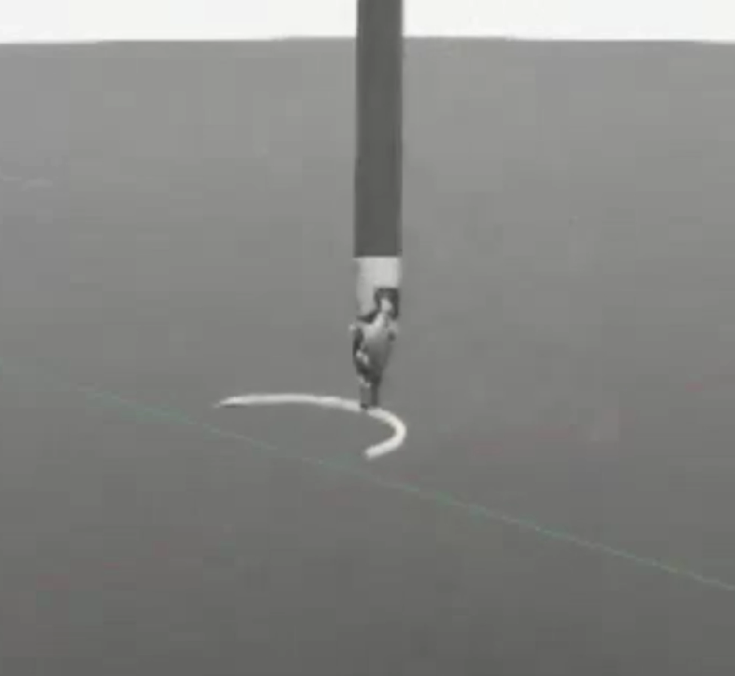

# Learning-Based Surgical Needle Manipulation in ORBIT-Surgical

[](https://docs.omniverse.nvidia.com/isaacsim/latest/overview.html)
[](https://isaac-sim.github.io/IsaacLab)
[](https://docs.python.org/3/whatsnew/3.10.html)
[](https://releases.ubuntu.com/22.04/)

## Overview

This project investigates learning-based surgical manipulation in simulation using ORBIT-Surgical framework and Isaac Lab.
It implements a complete robot learning pipeline for the Lift Needle benchmark, from demonstration collection to policy training and evaluation.

### Highlights

- State machine surgical needle benchmark
- Automatic demonstration collection
- Trajectory export and visualization
- Behavior Cloning (BC) 
- PPO
- BC + PPO
- Automatic checkpoint evaluation
- Algorithms comparison

## Setup

Once you are in the virtual environment, you do not need to use `${IsaacLab_PATH}/isaaclab.sh -p` to run python scripts. You can use the default python executable in your environment by running `python` or `python3`. However, for the rest of the documentation, we will assume that you are using `${IsaacLab_PATH}/isaaclab.sh -p` to run python scripts.

<!-- Download and install the [Git Large File Storage (LFS)](https://git-lfs.com/). Once downloaded and installed, set up Git LFS for your user account by running:
```bash
git lfs install
``` -->

Clone this repository to a directory **outside** the Isaac Lab installation directory:

```bash
git clone https://github.com/LenaASu/orbit-surgical.git
```

## Benchmark (State Machine)

<p align="center">
  
</p>

The state machine baseline successfully grasps and lifts a suture needle and is used to generate demonstration trajectories for imitation learning.

### Benchmark Video
https://github.com/user-attachments/assets/07509bdc-0bed-4780-8f30-1dbccac22174

## Dataset Statistics

- Successful demonstrations: 100
- Observation dimension: 34
- Action dimension: 8
- Mean trajectory length: 196.62 steps
- Environment: Isaac-Lift-Needle-PSM-IK-Abs

The dataset consists of 100 successful state-machine demonstrations collected on the Lift Needle task in `.pt` format.

Each trajectory stores:

- observations (34D)
- actions (8D)
- rewards
- episode information
- end-effector pose
- object pose

## Imitation Learning
### Behavior Cloning (BC)

1. Collect demonstrations with state machine for the environment `Isaac-Lift-Needle-PSM-IK-Abs-v0`:

```bash
${IsaacLab_PATH}/isaaclab.sh -p source/standalone/environments/state_machine/lift_needle_sm.py --task Isaac-Lift-Needle-PSM-IK-Abs-v0 --num_envs 1 
```

2. (Optional) Split the dataset into train and validation set: 

```bash
# split data
${IsaacLab_PATH}/isaaclab.sh -p source/standalone/workflows/robomimic/tools/split_train_val.py logs/robomimic/Isaac-Lift-Needle-PSM-IK-Abs-v0/hdf_dataset.hdf5 --ratio 0.2
```

3. Train a BC agent for `Isaac-Lift-Needle-PSM-IK-Abs-v0`. `BCPOlicy` was inspired by [Minari](https://minari.farama.org/tutorials/using_datasets/behavioral_cloning/) and [Imitation](https://imitation.readthedocs.io/en/latest/algorithms/bc.html)

```bash
${IsaacLab_PATH}/isaaclab.sh -p source/standalone/environments/learning/bc_mse_train.py --task Isaac-Lift-Needle-PSM-IK-Abs-v0 
```

4. Play the learned model to visualize results:

```bash
${IsaacLab_PATH}/isaaclab.sh -p source/standalone/environments/learning/bc_mse_eval.py --task Isaac-Lift-Needle-PSM-IK-Abs-v0 --checkpoint /PATH/TO/model.pth
```

## Reinforcement Learning
### PPO

Train an agent on `Isaac-Lift-Needle-PSM-IK-Abs-v0` with [RSL-RL](https://github.com/leggedrobotics/rsl_rl):

```bash
# run script for training
${IsaacLab_PATH}/isaaclab.sh -p source/standalone/environments/learning/ppo_train.py --task Isaac-Lift-Needle-PSM-IK-Abs-v0 --headless
# run script for playing with 32 environments
${IsaacLab_PATH}/isaaclab.sh -p source/standalone/environments/learning/ppo_train.py --task Isaac-Lift-Needle-PSM-IK-Abs-v0 --num_envs 32 
```

### BC + PPO

Train an agent on `Isaac-Lift-Needle-PSM-IK-Abs-v0`:

```bash
${IsaacLab_PATH}/isaaclab.sh -p source/standalone/environments/learning/bc_rsl_train.py --task Isaac-Lift-Needle-PSM-IK-Abs-v0 --num_envs 1 
```

### (Optional) TensorBoard: TensorFlow's visualization toolkit 

Monitor the training progress stored in the `logs` directory on [Tensorboard](https://www.tensorflow.org/tensorboard):

```bash
# execute from the root directory of the repository
${IsaacLab_PATH}/isaaclab.sh -p -m tensorboard.main --logdir=logs
```

## Results

The following results were evaluated on the Lift Needle task. Behavior Cloning policy learns Cartesian motion commands. Gripper actuation is currently controlled by a hand-crafted schedule.
PPO directly optimizes the manipulation policy through reinforcement learning.

| Method | Demonstrations | Success Rate (50 Episodes) |
|----------|----------|----------|
| State Machine | N/A | 100% |
| Behavior Cloning | 100 | 12% |
| PPO | N/A | 20% |

## Future Improvement

- Improve current BC and PPO performance
- Improve BC + PPO initialization
- DAgger
- GAIL
- Diffusion Policy
- (Optional) VLA
- (Optional) Sim-to-real

## Acknowledgement

NVIDIA Isaac Sim is available freely under [individual license](https://www.nvidia.com/en-us/omniverse/download/). For more information about its license terms, please check [here](https://docs.omniverse.nvidia.com/app_isaacsim/common/NVIDIA_Omniverse_License_Agreement.html#software-support-supplement).

Isaac Lab is released under [BSD-3-Clause License](https://github.com/isaac-sim/IsaacLab/blob/main/LICENSE).

Project template is partially from [Template for Isaac Lab Projects](https://github.com/isaac-sim/IsaacLabExtensionTemplate).

ORBIT-Surgical [framework](https://github.com/orbit-surgical/orbit-surgical) and [paper](https://arxiv.org/abs/2404.16027).
